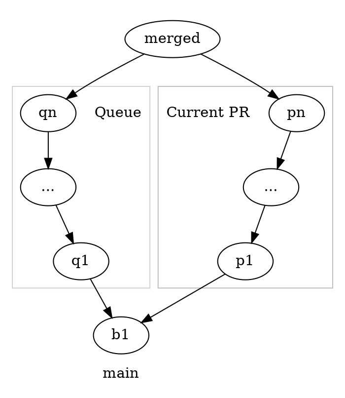
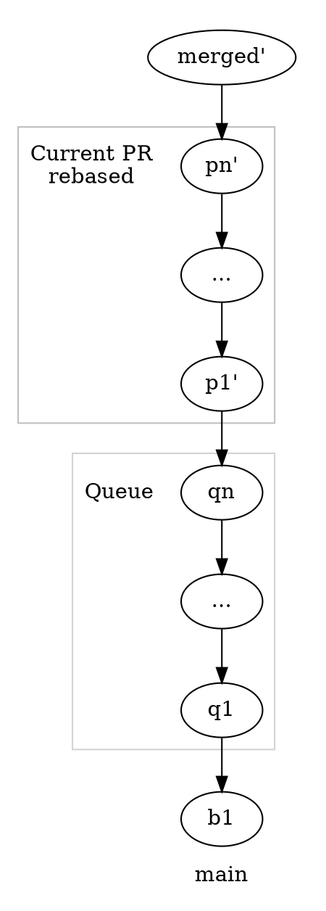

import { joined } from '@/stringUtils';
import { Note, Info } from '@/components/Info';
export const metadata = {
  title: 'PR Batching and Conflicts',
  description: joined`
    A description of the automatic conflict resolution system I built at
    Hockeystick.`,
  publishedAt: new Date("2025-04-10T17:00:00-04:00")
}

There is a bit of a problem with git workflows that require PRs to be up-to-date. If t<sub>c</sub> is how long your checks take to run, PRs must be up to date, and after changing the content of a PR the checks need to run again, then you can only merge 1 PR each t<sub>c</sub>.

If you get your checks to go decently fast that number can work for a fairly large project. You might be in trouble if you want to wait for re-approvals from reviewers though, as the average time it takes for a trivial re-approval will easily be long enough to have you limited to single digit PRs per day.

If you want to go beyond this limit your are going to need some way to relax that up-to-date requirement.

A merge train or queue is a technique for relaxing the up-to-date requirement without giving up too much in terms of correctness. If you can create a set of PRs that you can merge together in a given order without conflicts or failing checks on the result, then you allow them to all merge at once.

With respect to the constraint this has similar properties to allowing PRs to be out of date by a small fixed amount of time, but with more structure.

## The Problem

Back in late 2021 at Hockesytick we were having some issues with PRs being stalled for a long time as described above.
We were nowhere near the team size you would usually need to hit the limits I mentioned above, but there were some other things that got us there:

1. We were unfortunately relying on an amount of manual QA. This is in effect equivalent to an extremely long running CI check.
2. We were having a lot of cases where developers had real conflicts with other PRs that required manual resolution.

<Note>
  At the time GitLab had released its [merge trains](https://about.gitlab.com/blog/2020/01/30/all-aboard-merge-trains/) implementation but I was not yet aware of it. We were on GitHub and they wouldn't announce [merge queues](https://github.blog/engineering/engineering-principles/how-github-uses-merge-queue-to-ship-hundreds-of-changes-every-day/) until a bit later.

  I was basing my idea for this off of how the `linux-next` tree is contstructed by taking all the potential changes for the next merge window and attempting various merge orders to build the largest combined tree out of them. That is likely the original inspiration for the other versions as well.

  I'm going to call it a queue in general because train has a sort of awkward fit with the idea. Especially if you want to try and go faster by building a tree rather than a sequence of merges like the linux kernel version does, as then the individual PRs are no longer connected like train cars. A batch or window would probably be more fitting.
</Note>

## Building a Queue

So I start by building out a system to simply generate a batched PR from the all of the open ones against `main`.

Take everything open, approved, and passing checks, then iterate in PR number order to attempt to merge them one by one into a branch called `ci/development` that starts at main. Anything with conflicts is simply skipped at this point.

This first version doesn't do too much besides provide a bit of a heads up to developers when there will be upcoming conflicts with other branches.

To get to something that makes nice batches for QA we then need to add a way for the PRs to be marked as in need of update due to failing QA checks. This was done with a label added to the PRs indicating explicitly that they should be included in the build. Thus the process will now also create a `ci/qa` branch that uses the same rules as the development branch, but it only considers the labeled PRs.

<Info>
  One thing GitHub mentions in their documents on merge queues is that they specifically avoided a system involving tagging PRs. They have the right idea there as the tooling to manage these tags and provide adequate visibility of them expanded quite quickly.
</Info>

One interesting issue I discovered in the process is that for the QA branch it was undesirable to kick PRs out of the build unless the label was manually removed or the feature was merged. That means that I ended up making the queue a bit stateful, it would inspect the previous result and abort entirely rather than produce a QA integration branch that was missing things previously included(which you could manually override in a few ways).

<Note>
  That idea should be at least a bit concerning if you think about it as it implies that the QA process involves doing something meaningful using code that cannot be the final code actually merged.

  There is an analogue to the idea of performing anything less than the full test suite of the entire application in response to any single change to the code. If you haven't looked at the source you don't know that the changes are constrained to a single area, and even if you do look at the source it can be very hard to be certain of that.
</Note>

## Conflict Resolution

I wanted to offer developers the ability to solve conflicts with other PRs as few times as possible. The goal was to enable a number of queued PRs with changes in close proximity to go out at once without the developers needing to put their branches ahead of every conflicting branch.

As for how to actually do that, git has a related feature we can take inspiration from. Git rerere is a tool that saves the resolutions you pick for merge conflicts so that they can be re-applied when the exact same conflict is seen multiple times.

### Rerere

To see how to build this into the queue, lets have a quick look at how rerere works. You turn it on via the `rerere.enabled` setting in git and then any time you perform an operation that has conflicts it will hook into that to save and replay your resolutions.

So when you start a merge and have conflicts you will see notes that it saved a pre-image of the conflicts. The pre-images are essentially a copy of a file containing the git merge conflict markers, but with the branch info removed.

```diff
a
<<<<<<<
=======
c
>>>>>>>
c
```

Then when you finish resolving all the conflics it will create post-images for each file. The post-images simply contains a copy of the final version of the file you settled on in its entirety.

You can dig around in `.git/rr-cache` to see what it has saved in a given repository.

The tool will tend to err on the side of caution when determining if it can use a resolution, when it isn't obviously the exact same conflict it is probably better to make the user solve it again themselves.

### Reusable Conflict Resolutions

In our case we wanted something a little different.

* It should create a single file for each conflict resolution rather than each file.
* It should allow for a reasonable amount of flexibility in using the resolutions.

The latter point is because we are describing a resolution that applies only to one merge rather than globally, and it is being applied in a situation where asking the user to give a new resolution is more costly.

The solution that achieves this a tool the developer can run to do the following:

1. Start a merge with specific normalized settings to have git add in all the conflict markers in a consistent format.
2. Remove all of the labels from the markers and save the entire tree at that point as the pre-image.
3. Abort and redo the merge, this time using the user's settings for things like how conflicts are rendered.
4. Allow the user to resolve the merge.
5. Take the tree at the end of the resolution and compute the patch from the pre-image to the result.
6. Save that patch with a generated name in a hidden folder and output the path to the patch to the user.

The user can then add the patch to their PR and the merge queue will consume it when attempting to merge that PR.

That is where the system comes full circle. The simplicity of the queue design means that a user can run any part of the process on their machine. So that is what the tool does.

If you want to create the conflict resolutions for a given PR number, the tool will first run through the process of building up the queue branch locally up to the point where that PR is to be applied. The exact same code is used for this locally and in the tasks to ensure the results are the same.

The patch files get consumed as part of the queue process. When the queue merges a given PR, if there are conflicts, it will attempt to use the saved patches to resolve them. This is done by performing the same steps to get the tree into the pre-image state then attempting to apply the patches found in partial mode (which allows for parts of a patch to not need to be applied). Afterwards if there are no remaining conflict markers the code will also remove all of the patches it can find before finalizing the merge commit. If there are conflicts remaining it will abort applying that PR and move on to the next one.

When squash merges are used the result of removing patches in this way is that the conflict resolution patches will never appear in any commit in the history of the mainline branch.

<Note>
  The `.conflicts` folder where the patches were stored was one of the more under-developed aspects of the system. The tool I built would help the user out with whether they wanted to remove any patches they currently had and write new ones, or if they wanted to start with what they already had and add a new file making additional changes.

  Both of those options introduce a burden on the user to have an understanding of what is going on in their patches, and that is a problem. When new conflicts are introduced do you remember what is in your patches well enough to be able to make the right choice for what to do now? The patch files are not exactly easy to read if you want help recalling what is in there.

  There is the possibility that the right solution is simply to force the users to only have a single conflict resolution saved and always replace it.
</Note>

## Code Security Issues

One obvious problem with this approach is that the patches represent meaningful code changes that are effectively hidden during code review. Looking at a single PR, even if you could read the patch easily, some of the context for what it produces simply isn't in the PR.

The approach we used did involve someone doing a pass through the queue output as a pull request before merging it, but that is a big PR to review in a hurry.

Thus to facilitate reviewing the patch changes separately the process of building the queue is actually a little bit more complicated than what I've described so far.

### Conflict Resolution v2

The first step is still to simply perform the merge as described before. This creates the `merged` commit below.



Then we can go about creating the following linear commit graph by making use of that saved `merged` commit.



What we do is we replay the commits of the PR on top of the current queue, but for every commit we use the `ours` strategy to automatically resolve every conflict in favour of the version in the PR. These rebased commits are shown annotated with the `'` symbol.

Then after that we create a `merged'` commit which is set as having the parent `pn'` but the file tree from `merged`. This effectively discards the file tree that was computed by replaying the commits, but still preserves it in the git history.

<Info>
  Git doesn't actually store patches in its commits. The contents of a commit are a reference to a file tree, one or more parents, and all the metadata like title and description. That design makes it really easy to do an operation like this.
</Info>

Now each of `p1'` to `pn'` will have nearly the same changed lines as their counterparts and the `merged'` commit diff will contain only a readable version of the changes that the patches for the PR applied.

<Note>
  The tradeoff for this approach is pretty significant. The `pn'` may look on the surface to be similar to the contents of the original PR, but there is no guarantee that the state of the repository at that commit has much meaning. If there were conflicts it is quite likely that the commits represent nonsensical repository states that don't pass checks.
</Note>

## Thoughts

This was something that I enjoyed building, and that did enable us to move a lot faster, but it has significant tradeoffs and is by no means simple.

If anything I hope this serves as a bit of a cautionary tale to help you justify a much more significant up front investment in automated testing.

Worth mentioning though is that something people had a decent amount of trouble with is that they were maintaining two versions of their code at once, with the easily visible version not being the final one. So they would have to be aware enough to check that the version of their code with patches applied also works.

The options for improving that are definitely not simple, you would want to provide tools for the user to edit both versions as they are working rather than on demand. Such as by having their their local environment execute the version of the code with patches applied, but show them the version without patches unless they need to be prompted for new resolutions. It might even then not be possible to get that all the way to a great developer experience.

<Note>
  One thing I didn't discuss above that is somewhat related to that is that the GitHub and GitLab models specifically aims to run checks on each intermediary step of the queue. Not being able to do that in a reasonable manner is a further significant tradeoff of the conflict resolution approach used.
</Note>
